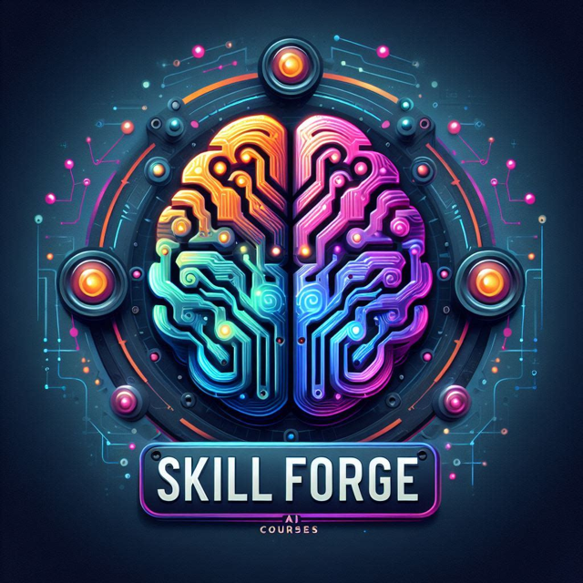
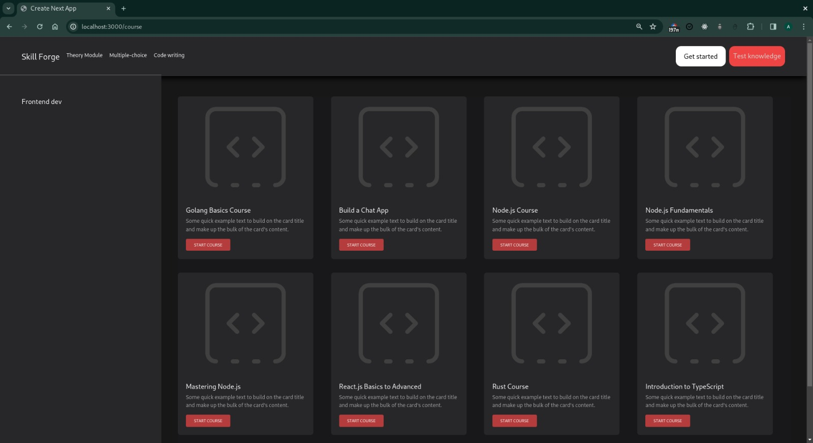
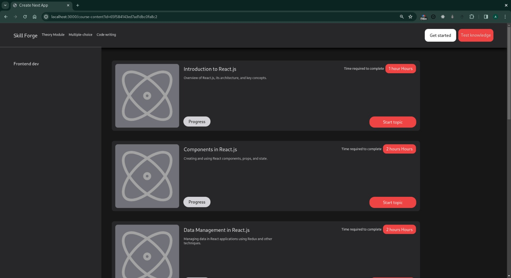
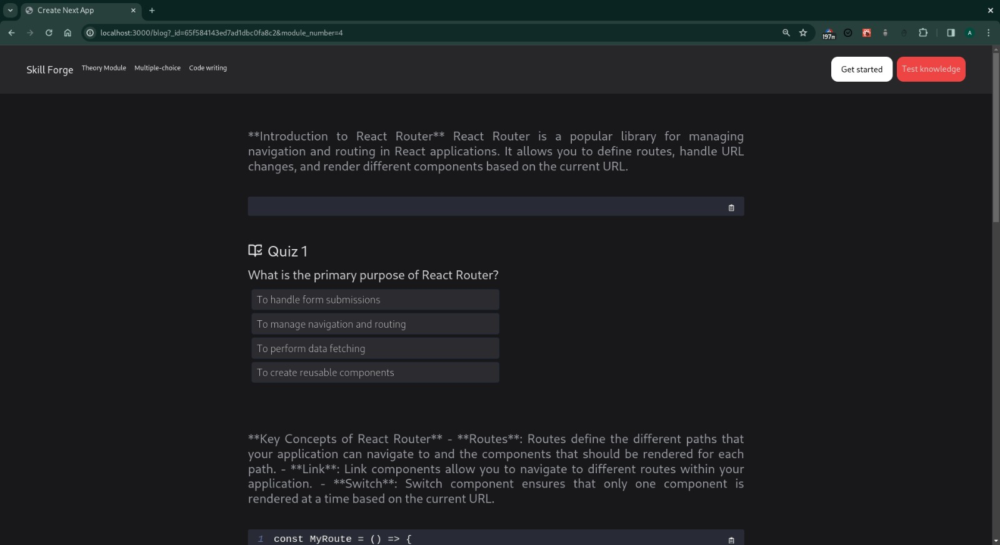

# Course Builder with Gemini API

A powerful tool to create personalized courses using content generated by the Gemini AI. This project streamlines course development, integrating quizzes and code examples to enhance the learning experience.

## Features

- **Dynamic Course Generation:** Harness the power of the Gemini API to generate comprehensive and engaging course content tailored to your needs.
- **Modular Structure:** Courses are organized into modules for a structured learning journey.
- **Interactive Quizzes:** Each module features quizzes to reinforce understanding and gauge knowledge retention.
- **Code Examples:** Relevant code snippets provide practical context and aid in skill development.

### Prerequisites

- A Gemini API key (Obtain one from their developer portal)

### Setup

1. Clone this repository.
2. Install dependencies (`npm install` or equivalent).
3. Create a `.env` file to store your Gemini API key:

## Images

